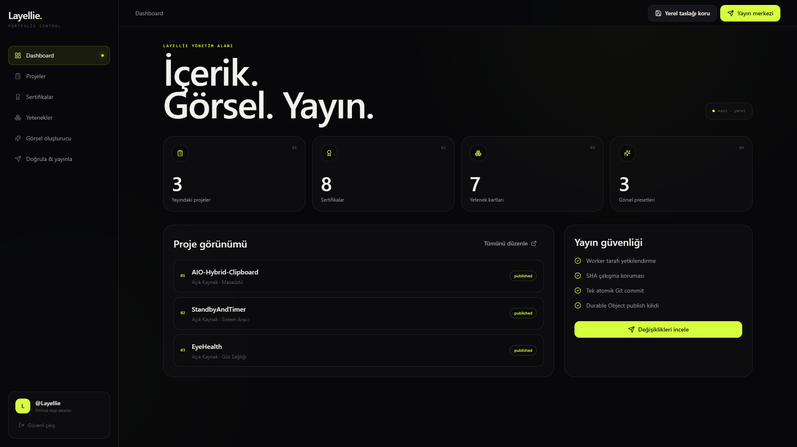
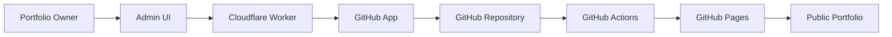

# Samet Kaşmer — Portfolio

Single-page, premium personal portfolio for a **Full-Stack Developer & Systems
Engineer** (Layellie). Built with **React + Vite + Tailwind CSS v4 + Framer
Motion + Lucide React**.

🌐 **Live:** https://layellie.github.io/

## Features

- Bold, modern typography with generous whitespace (Webflow-style aesthetic)
- High-contrast, monochrome **dark mode** with a subtle lime accent
- Scroll-triggered **fade-in-up** animations, marquee strip and elegant hovers
- Asymmetric / **bento-box** skills grid
- Large project cards with custom mock UIs
- **Bilingual (TR / EN)** with a language switcher (persisted in `localStorage`)
- **BTK Akademi certificates** mapped to skills (PDFs open in a new tab)
- **Live GitHub stats** (repos, stars, followers) via the GitHub API
- Sticky nav with **scroll-spy**, mobile menu and a scroll progress bar
- Subtle **falling-meteor** background animation
- **SEO:** Open Graph / Twitter meta, JSON-LD Person schema, `sitemap.xml` & `robots.txt`
- Versioned, Zod-validated bilingual JSON content
- Same-origin secure admin SPA on Cloudflare Workers Static Assets
- Modular project visual builder with three legacy-compatible presets

## Getting started

```bash
npm install
npm run dev:site      # http://localhost:5173
```

Production build:

```bash
npm run build
npm run preview
```

## Deployment (GitHub Pages)

Published at `https://layellie.github.io/` via **GitHub Actions**. Every push to
`main` automatically builds and deploys — no manual step needed:

```bash
git push          # triggers the auto-deploy workflow
```

Manual fallback (push the build to the `gh-pages` branch directly):

```bash
npm run deploy
```

> After connecting a custom domain, update `og:url`, `og:image`,
> `twitter:image` and `canonical` in `index.html`.

## Content and secure admin

Projects, certificates, skills and project visuals live in versioned files under
`src/content/`. Shared fields and `tr`/`en` text stay in the same record and are
validated at runtime with Zod.

The private admin SPA is served with its API from one Cloudflare Worker origin.
GitHub OAuth tokens never reach the browser; OAuth state, sessions, exact rate
limits and the publish lock use a SQLite Durable Object. Publishing creates one
non-force Git commit and lets the existing Pages workflow deploy it.

Setup and architecture:

- [Admin setup](docs/admin-setup.md)
- [Admin architecture and security](docs/admin-architecture.md)
- [Implementation plan](docs/admin-implementation-plan.md)

Validation commands:

```bash
npm test
npm run test:worker
npm run typecheck:worker
npm run build:site
npm run build:admin
npm run build:worker   # Wrangler dry-run; does not deploy
```

## Portfolio Admin & Publishing Backend



This is not a ready-made CMS or a Decap CMS integration. It is a custom,
GitHub-backed administration and publishing system built specifically for this
portfolio. The public portfolio runs on GitHub Pages, while its content remains
in version-controlled JSON files.

The admin interface is delivered through Cloudflare Worker Static Assets. The
Worker provides the authentication, validation and publish API boundary, with a
SQLite Durable Object used only for server-side session, OAuth state,
rate-limit and publish-lock state. Through a narrowly scoped GitHub App, the
admin commits content only to the permitted portfolio repository. GitHub
Actions validates that commit before deploying the public site to GitHub Pages.

Highlights include:

- Projects, certificates and skills CRUD
- Modular project visual builder and reusable visual presets
- Live responsive previews
- Local IndexedDB drafts with undo/redo
- Drag-and-drop ordering
- Canonical Zod content validation
- Media MIME, extension and magic-byte verification
- GitHub App OAuth owner authorization
- Atomic GitHub commits
- SHA conflict detection and three-way merge protection
- GitHub Actions validation and GitHub Pages deployment
- Responsive and reduced-motion-aware admin interface

### Architecture



### Security design

The GitHub App uses minimum repository permissions and its installation is
limited to the portfolio repository. Owner authorization combines a username
allowlist with an immutable numeric GitHub ID allowlist. OAuth state and PKCE,
CSRF and exact-origin validation, and HttpOnly, Secure and SameSite cookies
protect the browser boundary.

GitHub tokens are encrypted in server-side storage and sessions are
short-lived. API rate limiting, canonical server-side validation, atomic
commits, SHA conflict detection and merge protection reduce publishing risk.
No credentials are stored in this repository. See
[admin architecture and security](docs/admin-architecture.md) and the
[admin setup guide](docs/admin-setup.md) for the complete design and operating
procedure.

## Tech stack

| Layer     | Technology                              |
| --------- | --------------------------------------- |
| Framework | React 18 + Vite                         |
| Styling   | Tailwind CSS v4                         |
| Animation | Framer Motion                           |
| Icons     | Lucide React                            |
| Fonts     | Clash Display, General Sans (Fontshare) |
| Hosting   | GitHub Pages + Cloudflare Workers Free  |
